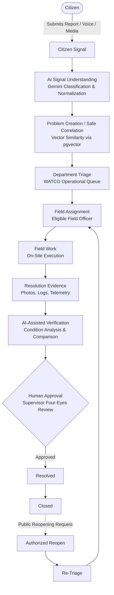
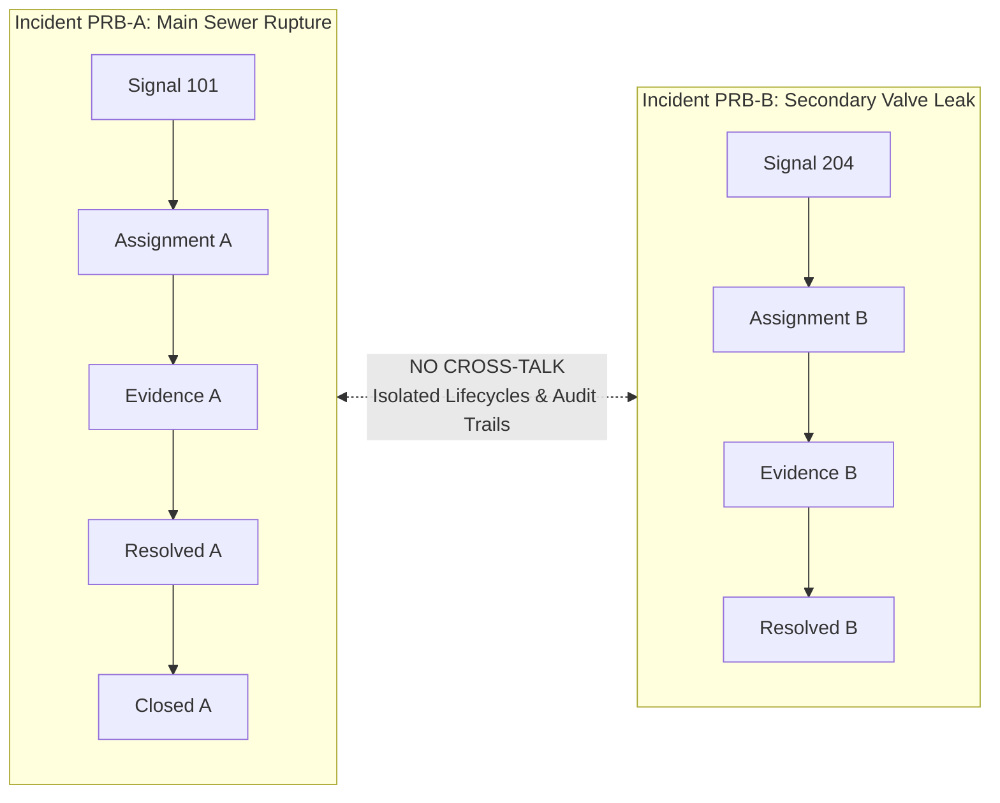
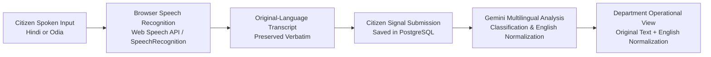
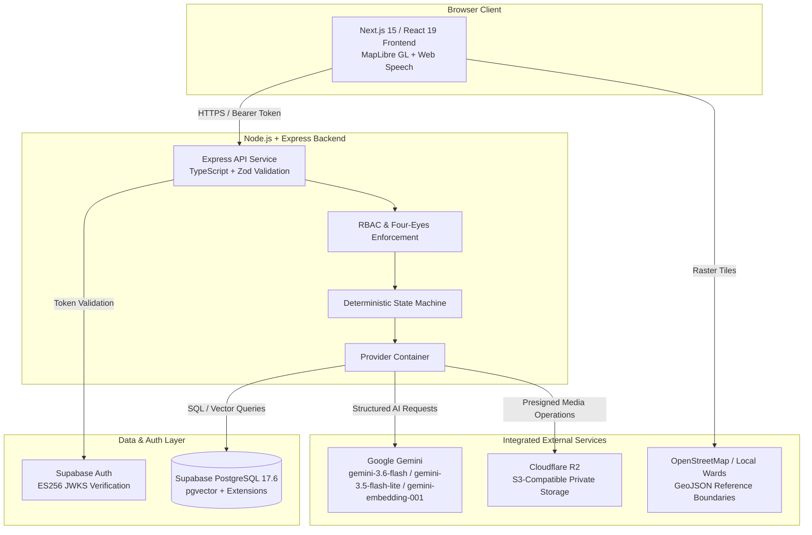
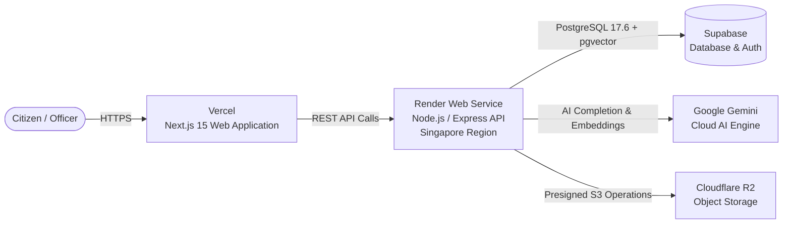

<div align="center">

# CIVICPULSE AI

### **Citizen Signals → Government Intelligence → Public Action**

Turn citizen-reported civic issues into structured, actionable, and accountable operational workflows.

---

**ZERO-DAY MINDS**  
*Ideas into impact*

<br />

[](https://www.typescriptlang.org/)
[](https://nextjs.org/)
[](https://react.dev/)
[](https://nodejs.org/)
[](https://www.postgresql.org/)
[](https://github.com/pgvector/pgvector)
[](https://deepmind.google/technologies/gemini/)
[](https://supabase.com/)
[](https://www.cloudflare.com/products/r2/)
[](https://maplibre.org/)
[](https://watcoodisha.in/)

<br />

[**Live Application**](https://civicpulse-ai-henna.vercel.app) &nbsp;&bull;&nbsp; [**Backend API**](https://civicpulse-backend-b9ul.onrender.com) &nbsp;&bull;&nbsp; [**GitHub Repository**](https://github.com/shavedXpixel/CivicPulse-AI)

<br />

</div>

---

## 1. What is CivicPulse AI?

**CivicPulse AI** is a civic-tech platform that transforms citizen-reported civic signals into structured, verifiable operational problems for municipal authorities. Rather than treating public grievances as passive complaint tickets that disappear into municipal backlogs, CivicPulse AI bridges the gap between public reporting, automated intelligence, and governed field execution.

The platform ingests citizen inputs across text, voice, and media, uses artificial intelligence to interpret unstructured information, identifies semantic relationships across related reports, and routes structured operational problems to designated public authorities. Every stage of work—triage, field assignment, on-site execution, resolution evidence submission, verification, and closure—is governed by strict state machines, role-based access control, and immutable audit logs.

Currently, CivicPulse AI operates with **WATCO (Water Corporation of Odisha)** as its authoritative operational department. The system enforces strict separation between algorithmic interpretation and administrative authority: artificial intelligence assists officers with semantic clustering, severity assessment, and evidence analysis, while authorized municipal personnel retain sole responsibility for binding public decisions.

---

## 2. The Core Idea

Public problem resolution requires a clear line of custody from citizen reporting to administrative sign-off. CivicPulse AI implements a deterministic operational pipeline where AI provides interpretive intelligence without bypassing human decision-makers.



> **Human-in-the-Loop Governance**: Google Gemini analyzes inputs, translates non-English signals into normalized English representations, calculates semantic similarity vectors, and evaluates resolution evidence. However, **only authorized municipal officers** can accept assignments, change problem states, approve resolutions, or authorize incident reopening.

---

## 3. Key Features

| Domain | Capability | Description |
| :--- | :--- | :--- |
| **Citizen Reporting** | Multi-channel Intake | Citizens submit issues with descriptive text, map-pinned coordinates, and photo/document evidence. Reports can be tracked transparently throughout their lifecycle. |
| **Multilingual Experience** | Vernacular First | Native interface support for **English**, **Hindi (हिन्दी)**, and **Odia (ଓଡ଼ିଆ)**, allowing citizens to engage in their preferred language. |
| **Voice Accessibility** | Browser-Native Speech | Speech-to-text input and read-aloud playback powered strictly by browser-native Web Speech APIs. Spoken input remains in the citizen's native language without streaming raw audio to external servers. |
| **AI Intelligence** | Gemini Classification & Correlation | Automated category classification, impact and severity inference, semantic similarity computation via `gemini-embedding-001`, and translation normalization into English. |
| **Operational Workflow** | Strict State Machine | Governed lifecycle transitions: `NEW` &rarr; `TRIAGED` &rarr; `ASSIGNED` &rarr; `IN_PROGRESS` &rarr; `AWAITING_VERIFICATION` &rarr; `RESOLVED` &rarr; `CLOSED` &rarr; `REOPENED`. |
| **Problem Isolation** | Independent Incident Boundaries | Distinct civic problems maintain isolated lifecycles. Active and closed incidents cannot be inadvertently absorbed, reassigned, or mutated by incoming reports. |
| **Resolution Verification** | Multimodal Evidence Review | Field officers submit repair photos and logs. Gemini compares reported conditions against resolution evidence to assist supervisory verification. |
| **Accountability & RBAC** | Four-Eyes Supervisory Defense | Strict role separation (Citizen, Field Officer, Department Officer, Admin). A supervisor cannot approve work they personally executed or submitted evidence for. |
| **Auditing & Concurrency** | Cryptographic & Version Controls | Hash-chained administrative audit logs, optimistic concurrency protection on database updates, and presigned media uploads. |

---

## 4. Why Problem Isolation Matters

In municipal operations, conflating distinct incidents creates ghost closures, unresolved field hazards, and unaccountable work orders. CivicPulse AI enforces **strict problem isolation**:



- **No Implicit Reopening**: A new report filed near a previously closed incident creates an independent signal or problem. It will never silently reopen, reassign, or alter an existing closed record.
- **Evidence Integrity**: Field evidence and contractor logs submitted for Incident A cannot be attached to or counted toward Incident B.
- **Independent SLAs**: Each operational problem maintains its own target hours, time elapsed, and risk calculation.

---

## 5. Role-Based Access Control & Governance

CivicPulse AI enforces explicit role-based permissions at the backend API layer:

| Role | Authoritative Scope & Responsibilities |
| :--- | :--- |
| **Citizen** | Authenticate, file civic reports, view own report timeline, receive status updates, and request reopening with justification. Cannot inspect administrative officer queues. |
| **Field Officer** | View problems specifically assigned to them in WATCO, transition assigned work to in-progress, upload resolution evidence (repair photos, work logs, field notes), and request verification. |
| **Department Officer** | Triage incoming WATCO problems, set priorities, assign eligible field personnel, review AI verification findings, inspect submitted evidence, resolve, close, or reopen incidents. |
| **Admin / System Admin** | Platform oversight, provision and manage department personnel, inspect cryptographic audit trails, and maintain reference municipal datasets. |

### The Four-Eyes Principle

To prevent conflicts of interest and fraudulent self-approvals, CivicPulse AI enforces a strict **Four-Eyes Approval Defense** (`AUD-SELF-01`):

$$\text{Approving Supervisor} \ne \text{Assigned Field Officer} \quad \land \quad \text{Approving Supervisor} \notin \text{Evidence Submitters}$$

If an officer with supervisory privileges personally executes field work on an incident or submits resolution evidence for that incident, the backend explicitly blocks that officer from approving the resolution. A different qualified supervisor must conduct the final review.

---

## 6. Multilingual & Voice Accessibility

CivicPulse AI supports native linguistic inclusion across three primary languages:

<div align="center">

| English | हिन्दी (Hindi) | ଓଡ଼ିଆ (Odia) |
| :---: | :---: | :---: |
| Native UI & API | Full localization & Voice Input | Full localization & Voice Input |

</div>



### Architectural Safeguards:
1. **Privacy-Preserving**: No raw microphone audio streams are transmitted or stored on backend servers. Voice recognition executes entirely within the citizen's browser using native Web Speech APIs (`SpeechRecognition` / `webkitSpeechRecognition`).
2. **Transcript Preservation**: The original vernacular text is stored immutably in the citizen's submission record.
3. **Downstream Normalization**: Non-English reports are translated into a normalized English representation by Google Gemini, ensuring standardized triage, vector embedding, and search across municipal systems.

---

## 7. AI Architecture & Boundaries

Artificial intelligence in CivicPulse AI operates strictly as an **intelligence and interpretation layer**, not an autonomous administrative decision-maker.



### AI Responsibilities vs. Deterministic Code

| Functionality | Handled By | Implementation Details |
| :--- | :--- | :--- |
| **Language Detection & Normalization** | Google Gemini | Detects input language; generates normalized English text for downstream search. |
| **Issue Classification** | Google Gemini | Extracts category, subcategory, urgency, and affected entities from unstructured text. |
| **Semantic Embedding** | Google Gemini | Generates dense vector representations using `gemini-embedding-001`. |
| **Vector Similarity Search** | Supabase PostgreSQL | Computes cosine distance using `pgvector` operators to detect related problems. |
| **Evidence Analysis** | Google Gemini | Compares before/after conditions and highlights discrepancies via `gemini-3.5-flash-lite`. |
| **State Machine & Status Transitions** | Deterministic Code | Strictly validates lifecycle transitions in TypeScript; rejects invalid transitions. |
| **Permissions & Four-Eyes Defense** | Deterministic Code | Rejects self-approval attempts and checks JWT scopes before executing workflow actions. |
| **Mathematical Impact Scoring** | Deterministic Code | Formulaic calculation based on severity, population density, duration, and critical facilities. |
| **SLA Countdown & Risk Calculation** | Deterministic Code | Computes time elapsed, hours remaining, and breach flags based on immutable timestamps. |

---

## 8. Production Architecture

The system is deployed on modern cloud infrastructure configured for resilience, strict provider boundaries, and data co-location:



### Service Liveness Probes
The backend exposes public health endpoints used by hosting platforms and load balancers:
- `GET /health` &rarr; Lightweight public probe returning `{"status": "ok"}` for container liveness.
- `GET /api/v1/health` &rarr; Detailed liveness probe returning system status, API version, and timestamp.
- `GET /api/v1/ready` &rarr; Deep readiness probe validating operational database connectivity.

---

## 9. Application Workflow by Role

| Workflow Phase | Citizen | Department Officer (WATCO) | Field Officer | AI Assistant (Gemini) |
| :--- | :---: | :---: | :---: | :---: |
| **1. Reporting** | Submits report, photo, coordinates | &mdash; | &mdash; | Analyzes text, extracts intent, generates embedding |
| **2. Correlation** | Receives submission tracking ID | Inspects candidate problem cluster | &mdash; | Evaluates semantic similarity with existing signals |
| **3. Triage & Assignment** | Tracks status: `TRIAGED` | Prioritizes and assigns field officer | Receives work assignment notification | Predicts department jurisdiction |
| **4. Field Execution** | Tracks status: `IN_PROGRESS` | Monitors SLA timer and workload | Executes work, uploads repair photos and logs | &mdash; |
| **5. Verification** | Tracks status: `AWAITING_VERIFICATION` | Reviews evidence and AI verification report | Awaits supervisory review | Compares reported fault vs. repair evidence |
| **6. Resolution & Closure** | Views resolution notice | Formally resolves and closes incident | Notified of case resolution | &mdash; |
| **7. Reopen (If Needed)** | Files reopening request with note | Re-evaluates case and reassigns work | &mdash; | Analyzes reopening justification |

---

## 10. Product Preview

<!-- Add screenshot: Citizen Report -->
> *Figure 1: Multilingual citizen reporting interface with voice input and location pinning.*

<!-- Add screenshot: Department Officer Queue -->
> *Figure 2: WATCO Department Officer operational dashboard with SLA indicators and workload tracking.*

<!-- Add screenshot: Field Officer Workspace -->
> *Figure 3: Field officer assignment view with task execution steps and evidence submission controls.*

<!-- Add screenshot: Evidence & Verification -->
> *Figure 4: Resolution verification modal displaying submitted repair photos and Gemini evidence analysis.*

<!-- Add screenshot: Closed → Reopened -->
> *Figure 5: Incident audit timeline showing complete lifecycle history from creation to closure and reopening.*

---

## 11. Technology Stack

| Layer | Component | Technology / Implementation |
| :--- | :--- | :--- |
| **Frontend** | Framework & UI | Next.js 15 (App Router), React 19, TypeScript, Tailwind CSS, Lucide Icons |
| **Frontend** | Maps & Geospatial | MapLibre GL 5.1, OpenStreetMap raster tiles, Bhubaneswar Municipal Ward GeoJSON |
| **Frontend** | Speech & Audio | Web Speech API (`SpeechRecognition`, `speechSynthesis`) |
| **Backend** | API Engine | Node.js 22, Express 4, TypeScript, Zod Schema Validation |
| **Authentication** | Identity Provider | Supabase Auth (ES256 asymmetric JWT verification via JWKS) |
| **Database** | Primary Store | Supabase PostgreSQL 17.6 with `uuid-ossp`, `pgcrypto` |
| **Vector Search** | Similarity Engine | PostgreSQL `pgvector` extension for dense embedding similarity |
| **Artificial Intelligence** | LLM & Embeddings | Google Gemini (`gemini-3.6-flash`, `gemini-3.5-flash-lite`, `gemini-embedding-001`) |
| **Storage** | Media & Attachments | Cloudflare R2 (S3-compatible API, presigned upload URLs, private buckets) |
| **Deployment** | Frontend Hosting | Vercel (Production Edge deployment) |
| **Deployment** | Backend Hosting | Render Web Service (Singapore region, containerized Node.js) |
| **Testing** | Test Runners | Vitest, Supertest |

---

## 12. Project Structure

CivicPulse AI is structured as an npm workspaces monorepo:

```text
CivicPulse-AI/
├── backend/                  # Node.js + Express backend service
│   ├── src/
│   │   ├── app.ts            # Express application bootstrap & route mounting
│   │   ├── config/           # Environment and runtime configuration
│   │   ├── middleware/       # Authentication, RBAC, logging, error handlers
│   │   ├── modules/          # Business logic (problems, signals, workflow, resolutions)
│   │   ├── providers/        # Concrete providers (Supabase, Postgres, Gemini, R2)
│   │   └── services/         # Domain services and data orchestration
│   ├── tests/                # Comprehensive Vitest backend test suites
│   ├── Dockerfile            # Container definition for production deployment
│   └── package.json
├── frontend/                 # Next.js 15 web application
│   ├── src/
│   │   ├── app/              # Next.js App Router pages and layouts
│   │   ├── components/       # Reusable civic UI components, maps, and modals
│   │   ├── context/          # React authentication and application state
│   │   ├── hooks/            # Custom hooks (speech-to-text, text-to-speech, geolocation)
│   │   └── i18n/             # Translations for English, Hindi, and Odia
│   ├── tests/                # Frontend Vitest test suites
│   ├── next.config.mjs
│   └── package.json
├── shared/                   # Monorepo shared package
│   ├── src/
│   │   ├── constants/        # System constants and taxonomy definitions
│   │   ├── schemas/          # Zod validation schemas shared across client & server
│   │   └── types/            # TypeScript interfaces, enums, and data contracts
│   └── package.json
├── supabase/                 # Database migrations and schema definitions
│   └── migrations/           # PostgreSQL migration scripts (0001–0010)
├── docs/                     # Specifications, architecture, and maintenance documentation
└── package.json              # Monorepo root workspace configuration
```

---

## 13. Local Development

### Prerequisites
- **Node.js**: v20.x or v22.x
- **npm**: v10.x or higher
- Access to Supabase PostgreSQL, Google Gemini API, and Cloudflare R2 (or local development equivalents)

### Setup Instructions

1. **Clone the repository:**
   ```bash
   git clone https://github.com/shavedXpixel/CivicPulse-AI.git
   cd CivicPulse-AI
   ```

2. **Install monorepo dependencies:**
   ```bash
   npm install
   ```

3. **Configure Environment Variables:**
   Copy the example environment template:
   ```bash
   cp .env.example .env
   ```

   Populate `.env` with your own credentials (do **not** commit this file):

   <details>
   <summary><strong>View documented configuration variables</strong></summary>

   ```ini
   # Application Runtime
   NODE_ENV=development
   PORT=5000
   FRONTEND_PORT=3000
   NEXT_PUBLIC_API_URL=http://localhost:5000/api/v1
   CORS_ALLOWED_ORIGINS=http://localhost:3000,http://127.0.0.1:3000

   # Target Architecture Providers
   PROVIDER_MODE=cloud
   DEMO_MODE=false
   AUTH_PROVIDER=supabase
   DATABASE_PROVIDER=postgres
   STORAGE_PROVIDER=r2
   AI_PROVIDER=gemini

   # Supabase Database & Auth
   SUPABASE_URL=https://<your-project-ref>.supabase.co
   SUPABASE_SECRET_KEY=<your-supabase-secret-key>
   DATABASE_URL=postgresql://postgres.<your-project-ref>:<password>@aws-0-ap-northeast-1.pooler.supabase.com:5432/postgres
   NEXT_PUBLIC_SUPABASE_URL=https://<your-project-ref>.supabase.co
   NEXT_PUBLIC_SUPABASE_PUBLISHABLE_KEY=<your-supabase-publishable-key>

   # Google Gemini AI
   GEMINI_API_KEY=<your-gemini-api-key>
   GEMINI_PRIMARY_MODEL=gemini-3.6-flash
   GEMINI_FALLBACK_MODEL=gemini-3.5-flash
   GEMINI_MODEL_VERIFICATION=gemini-3.5-flash-lite
   AI_EMBEDDING_MODEL=gemini-embedding-001

   # Cloudflare R2 Storage
   R2_ACCOUNT_ID=<your-r2-account-id>
   R2_ACCESS_KEY_ID=<your-r2-access-key-id>
   R2_SECRET_ACCESS_KEY=<your-r2-secret-access-key>
   R2_BUCKET_NAME=civicpulse-media

   # Map Tiles
   NEXT_PUBLIC_MAP_TILE_URL=https://tile.openstreetmap.org/{z}/{x}/{y}.png
   ```
   </details>

4. **Build the Shared Workspace:**
   ```bash
   npm run build:shared
   ```

5. **Start Both Services in Development Mode:**
   ```bash
   npm run dev
   ```
   *Alternatively, run services individually:*
   - Backend: `npm --prefix backend run dev` (starts on port 5000)
   - Frontend: `npm --prefix frontend run dev` (starts on port 3000)

---

## 14. Testing & Verification

The repository contains automated test suites covering backend API endpoints, state machine transitions, four-eyes enforcement, AI resilience, database providers, and frontend user workflows.

### Running Test Suites

- **Run all monorepo test suites:**
  ```bash
  npm run test
  ```

- **Run backend test suite:**
  ```bash
  npm run test:backend
  ```

- **Run frontend test suite:**
  ```bash
  npm run test:frontend
  ```

- **Run shared package test suite:**
  ```bash
  npm run test:shared
  ```

### Build & Type Verification

- **Compile and verify all workspaces:**
  ```bash
  npm run build
  ```

- **Typecheck and lint all workspaces:**
  ```bash
  npm run lint
  ```

### Key Areas Covered by Tests
- **Workflow State Machine**: Validation of allowed and prohibited state transitions.
- **Problem Isolation**: Guaranteeing that closed and active incidents are never mutated by incoming signals.
- **Four-Eyes Defense**: Preventing supervisors from approving work they performed or submitted evidence for.
- **Concurrency & Idempotency**: Safe concurrent status transitions and duplicate action prevention.
- **AI Resilience**: Graceful error handling and retry mechanisms for Gemini API calls.
- **Language Normalization**: Correct parsing and normalization of vernacular citizen signals.

---

## 15. Security & Governance Principles

CivicPulse AI is engineered with defensive architectural boundaries suitable for public sector infrastructure:

- **Asymmetric Authentication**: Supabase Auth tokens are verified on the backend using standard ES256 JSON Web Key Sets (JWKS). The backend resolves user profiles strictly via immutable user IDs.
- **Backend-Only Database Access**: PostgreSQL connection credentials and database queries reside exclusively on the backend API service. No direct public database access is permitted.
- **Four-Eyes Approval Defense**: Enforced by backend validation logic to eliminate conflict of interest during ticket resolution.
- **Optimistic Concurrency Control**: Entity mutations verify version identifiers to prevent race conditions during concurrent triage or assignment updates.
- **Immutable Administrative Audit Trail**: Administrative staff actions and state modifications are stored with cryptographic hashes referencing previous events (`previous_hash`), forming a verifiable audit log.
- **Private Object Storage**: Citizen photos and repair evidence are stored in private Cloudflare R2 buckets. Access is governed via time-limited presigned URLs or authenticated streaming endpoints.
- **Zero Frontend Secrets**: API keys, database credentials, and service keys are never bundled into client-side code.
- **Zero Audio Storage**: Browser voice recognition uses native Web Speech APIs; raw microphone audio is processed locally and never recorded or uploaded to servers.

---

## 16. Future Scope

The following areas represent potential architectural extensions and broader civic integrations:

- **Multi-Department Expansion**: Expanding operational routing beyond WATCO to municipal engineering, sanitation, electrical utilities, and roads departments.
- **Broader Linguistic Coverage**: Adding support for additional regional Indian languages such as Bengali, Telugu, and Santali.
- **Edge Field Operations**: Offline-capable mobile client synchronization for field workers in connectivity-constrained zones.
- **Predictive Infrastructure Planning**: Aggregated spatial-temporal clustering to identify chronic municipal infrastructure failure points before service disruptions occur.
- **Automated Telemetry Integration**: Ingesting IoT sensor streams from municipal water pressure gauges and pump telemetry directly into the signal pipeline.

---

## 17. Contributing

Contributions to CivicPulse AI are welcome. To propose enhancements or fixes:

1. **Fork the repository** on GitHub.
2. **Create a topic branch** from `main` or `master`:
   ```bash
   git checkout -b feature/my-feature-name
   ```
3. **Commit your modifications** with clear, descriptive commit messages.
4. **Ensure all test suites pass**:
   ```bash
   npm run lint && npm run test && npm run build
   ```
5. **Push to your fork** and submit a **Pull Request** detailing the rationale, changes made, and test validation.

---

## 18. License

License: Not yet specified.

---

<div align="center">

### CIVICPULSE AI

**Citizen Signals → Government Intelligence → Public Action**

**ZERO-DAY MINDS**  
*Ideas into impact*

<br />

[**Live Demo**](https://civicpulse-ai-henna.vercel.app) &nbsp;&bull;&nbsp; [**GitHub Repository**](https://github.com/shavedXpixel/CivicPulse-AI)

</div>
